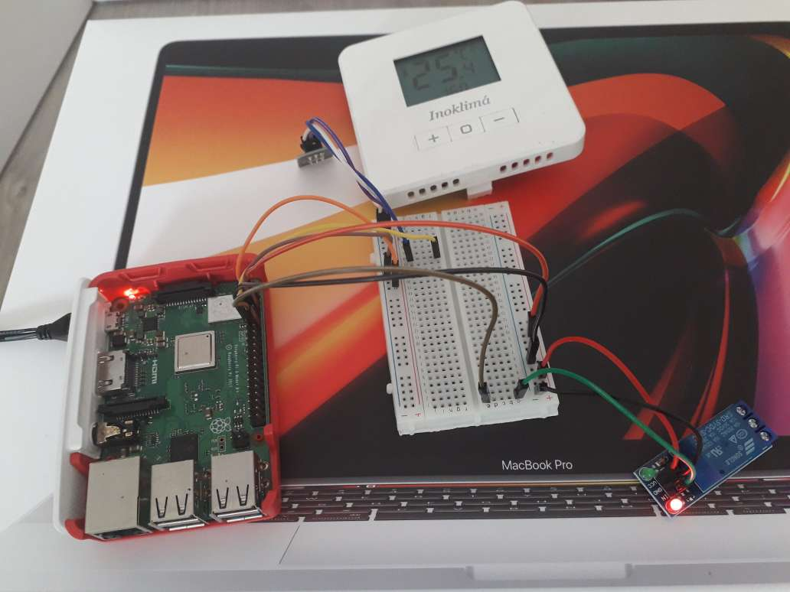

# home-automation-thermostat

## Built with
* Python 3.x

## Hardware

- [Raspberry Pi 3 Model B +](https://www.raspberrypi.org/documentation/usage/gpio/)
- [DS18B20 temperature sensor](https://cleste.ro/modul-senzor-de-temperatura-ds18b20.html)
- [5V Relay](https://cleste.ro/modul-releu-1-canal-5v.html)

### Hardware Picture
1. **Inoklima Thermometer on the TOP**

2. **Prototype Thermometer on the BOTTOM**



## Usage

```code
python3 thermostat/relay/relay.py

python3 thermostat/sensor/sensor.py
```
